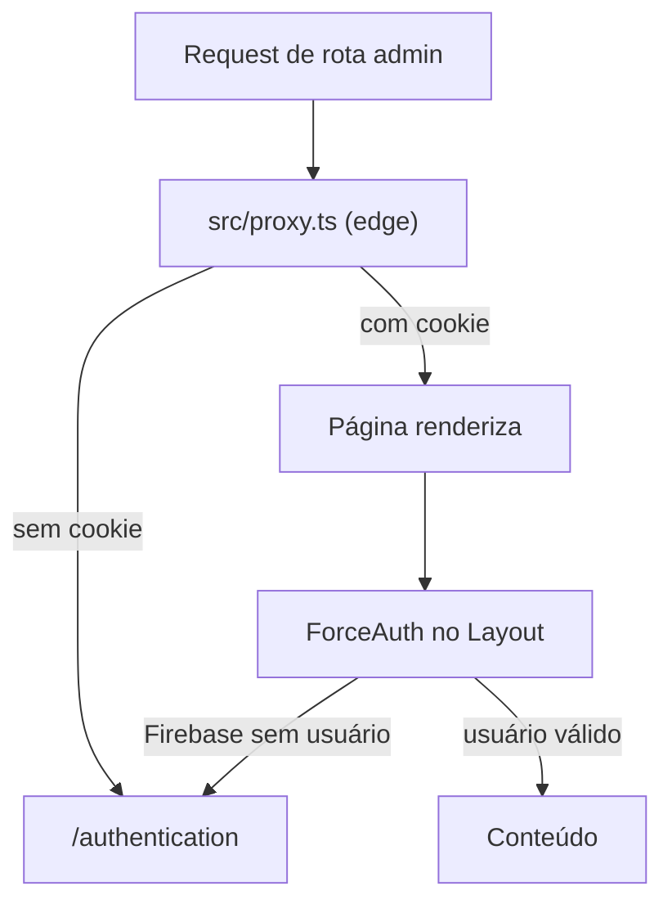

# admin-template-next

Template de painel administrativo para começar projetos novos: App Router do Next.js 16, autenticação Firebase, tema claro/escuro persistido e um conjunto pequeno de componentes de UI já prontos.

## O que vem pronto

- **Autenticação Firebase** — login com Google, login por email/senha e cadastro
- **Shell de admin** — menu lateral, header com avatar e toggle de tema, guarda de rota
- **Design system mínimo** — `Button`, `Input`, `Card`, `Table`, `Modal`, `Spinner`, `Alert`
- **Tema por tokens** — um único lugar para trocar as cores, sem `dark:` espalhado
- **Testes** — Vitest + React Testing Library, com cobertura sob threshold no CI

## Começando

```bash
npm install
cp .env.example .env.local   # preencha com as credenciais do seu app Firebase
npm run dev
```

Abra [http://localhost:3000](http://localhost:3000). Sem login, você cai em `/authentication`.

> Rode **apenas um** `npm run dev` por projeto — o Next 16 bloqueia o segundo.

### Credenciais do Firebase

Crie um Web App no [console do Firebase](https://console.firebase.google.com/), habilite os provedores Google e Email/Senha em Authentication, e copie os valores para o `.env.local`:

```
NEXT_PUBLIC_FIREBASE_API_KEY=
NEXT_PUBLIC_FIREBASE_AUTH_DOMAIN=
NEXT_PUBLIC_FIREBASE_PORJECT_ID=
```

O typo `PORJECT_ID` é o nome que `src/firebase/config.js` lê. Mantenha os dois lados iguais, ou renomeie ambos.

## Adaptando o template

Quase tudo que identifica o projeto está em [src/config/app.ts](src/config/app.ts):

```ts
export const appConfig = {
  name: "Admin Template", // título da aba e metadata
  description: "Next.js admin template starter",
  locale: "en", // atributo lang do <html>
  authCookieName: "admin-template-auth",
  themeStorageKey: "theme",
  defaultTheme: "dark",
  loginRoute: "/authentication",
  homeRoute: "/",
};

export const navItems = [
  { label: "Home", url: "/", icon: IconHome },
  { label: "Settings", url: "/settings", icon: IconAdjustments },
  { label: "Notifications", url: "/notifications", icon: IconBell },
];
```

**Para adicionar uma rota:** crie `src/app/<rota>/page.tsx` renderizando `<Layout title subtitle>`, adicione a entrada em `navItems` e reinicie o dev server. Há um teste que falha se uma url do menu não tiver `page.tsx` correspondente.

**Para trocar as cores:** ajuste as variáveis `--brand*` e as de superfície em [src/styles/globals.css](src/styles/globals.css). Os componentes usam tokens (`bg-background`, `bg-surface-raised`, `border-border`, `text-brand`), então não é preciso caçar classes de cor pelo projeto.

**Para trocar a logo:** [src/components/template/Logo.tsx](src/components/template/Logo.tsx).

## Estrutura

```
src/
  app/                    # rotas (App Router)
  config/app.ts           # nome, locale, menu, cookie, tema
  components/
    ui/                   # design system (Button, Input, Card, Table, Modal, Spinner, Alert)
    template/             # shell do admin (Layout, SideMenu, Header, ...)
    auth/                 # campos do formulário de login
    icons/                # ícones SVG
  data/                   # context/ + hook/ (Auth, tema)
  firebase/config.js      # único ponto que fala com o SDK
  functions/ForceAuth.tsx # guarda de rota no client
  lib/cn.ts               # utilitário de classNames
  proxy.ts                # guarda no edge (Next 16: ex-middleware.ts)
  styles/globals.css      # Tailwind v4 e tokens de tema
__tests__/                # espelha src/; mocks em __tests__/helpers/
```

## Comandos

```bash
npm run dev            # servidor de desenvolvimento
npm run build          # build de produção
npm run lint           # ESLint
npm run format         # Prettier
npm run test           # Vitest em watch
npm run test:run       # roda a suíte uma vez
npm run test:coverage  # cobertura com threshold
```

## Como funciona a autenticação

A sessão vive em [src/data/context/AuthContext.tsx](src/data/context/AuthContext.tsx) e é consumida pela UI só através do hook `useAuth`.



Duas observações importantes antes de levar isso a produção:

- O cookie é apenas uma **flag booleana**, não o JWT. Ele diz "esse browser já logou", e por isso o `proxy.ts` é uma checagem otimista, não autorização — qualquer um pode forjar o cookie e receber o HTML da página. A validação real acontece no client, no `ForceAuth`, contra o Firebase.
- Para autorização de verdade (proteger dados, não só telas), troque por um session cookie assinado, verificado no servidor com o Firebase Admin SDK.

O cadastro por email/senha não exige `emailVerified`, porque não há envio de email de verificação. Se você adicionar esse envio, passe a exigir a verificação em `configSession`.

## Documentação adicional

- [docs/lessons-learned.md](docs/lessons-learned.md) — erros já enfrentados neste projeto e como foram resolvidos
- `AGENTS.md` e `.cursor/rules/` — contexto para agentes de código
- A documentação do Next.js 16 está em `node_modules/next/dist/docs/`
